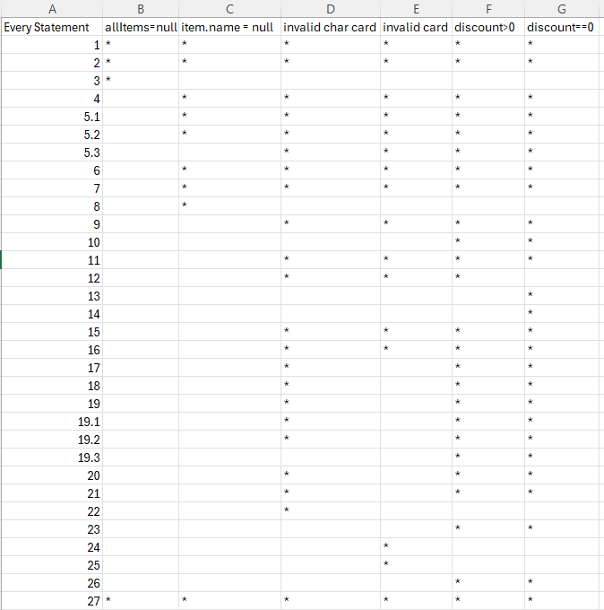

Bejza Shashko 236023

2. Control Flow Graph
Следната слика го прикажува CFG дијаграмот на функцијата checkCart:

3.
Цикломатската комплексност ја пресметав со три различни методи, и сите дадоа ист резултат.
Број на ребра = 38
Број на јазли = 31
Cyclomatic complexity = E - N + 2 = 38 - 31 + 2 = 9 
Cyclomatic complexity = P + 1 = 8 + 1 = 9
Cyclomatic complexity = R (Regions) = 9

Цикломатската комплексност на checkCard е 9.

4.
Критериумот бара секоја наредба (statement) во функцијата checkCart да биде извршена барем еднаш. За да се постигне ова, се дефинирани 6 тест случаи.  
TC1 - тестира дали функцијата фрла исклучок ако листата на Items е null.  
TC2 - тестира дали се фрла исклучок за item со име null или item без име.  
TC3 - тестира дали функцијата фрла изклучок ако картицката содржи недозволени карактери.  
TC4 - тестира дали функцијата фрли изклучок ако бројот на картчката има различна должина од 16.  
TC5 - тестира попуст (discount > 0), при што се одзема 30 од сумата и се користи формула со попуст.  
TC6 - тестира валиден предмет без попуст, каде се користи нормалната формула за пресметка.  

5.
За условот if (item.getPrice() > 300 || item.getDiscount() > 0 || item.getQuantity() > 10) потребни се 4 тест случаи за да се постигне Multiple Condition criterium:  
TC1 - сите три под-услови да се неточни.  
TC2 - само првиот под-услов да е точен(price > 300).  
TC3 - само вториот под-услов да е точен(discount > 0).  
TC4 - само третиот под-услов да е точен(quantity > 10).  
